# 오늘갈까 MCP

[](https://www.typescriptlang.org/)
[](https://modelcontextprotocol.io/)
[](LICENSE)

> **[카카오 AGENTIC PLAYER 10](https://b.kakao.com/views/PlayMCP/AGENTIC_PlAYER_10) PlayMCP 공모전 제출을 위해 제작한 카카오 MCP 작품입니다.**<br>
> PlayMCP와 Kakao Tools에서 일상적인 외출 결정을 돕기 위해 개발한 MCP 서버입니다.

서울 주요 권역의 혼잡도, 날씨와 대기질, 대중교통 부담, 문화행사 정보를 종합해 **지금 실행하기 좋은 외출 코스**를 추천합니다. 최단 경로보다 “지금 이 외출을 해도 괜찮은가?”에 답하는 데 초점을 둡니다.

## 이런 질문을 할 수 있어요

```text
지금 여의도 가도 괜찮아?
성수에서 출발해서 2시간 정도 덜 붐비는 데이트 코스 추천해줘
광화문 근처 지금 볼 만한 무료 행사 있어?
```

## 주요 기능

| 기능 | 제공 내용 |
| --- | --- |
| 현재 권역 상태 | 혼잡도, 날씨, 대기질, 교통 부담, 행사 수 |
| 외출 판단 | 현재 조건을 `GO`, `CAUTION`, `AVOID`로 정리 |
| 장소 탐색 | 동행자, 시간, 실내 선호, 혼잡 회피 조건 반영 |
| 실시간 행사 | 권역과 무료 여부에 맞는 문화행사 상세 검색 |
| 코스 추천 | 추천 코스와 이유, 주의사항, 대안 코스 제공 |

## 동작 방식




## 제공 도구

| Tool | 역할 |
| --- | --- |
| `get_area_status` | 특정 서울 권역의 현재 외출 조건 확인 |
| `check_outing_risk` | 외출 적합도를 `GO`, `CAUTION`, `AVOID`로 판단 |
| `find_events_now` | 현재 확인 가능한 실시간 문화행사 검색 |
| `find_good_places_now` | 사용자 조건에 맞는 장소 후보 탐색 |
| `recommend_outing_plan` | 실행 가능한 외출 코스와 대안 추천 |

모든 도구는 읽기 전용이며 MCP tool annotations를 제공합니다.

<details>
<summary>지원하는 서울 15개 권역</summary>

성수/서울숲, 홍대/연남, 여의도, 잠실, 광화문/종로, 강남역, 명동, DDP/동대문, 서울역, 이태원, 북촌, 코엑스/삼성, 남산, 건대입구, 고속터미널

</details>

## 빠른 시작

Node.js 20 이상이 필요합니다.

```bash
git clone https://github.com/ChoBazzi/oneul-galkka-mcp.git
cd oneul-galkka-mcp
npm ci
cp .env.example .env
npm run build
npm test
```

`.env`에 서울 열린데이터광장 API 키를 설정하면 실시간 도시데이터를 조회합니다.

```dotenv
SEOUL_OPEN_DATA_API_KEY=
SEOUL_OPEN_DATA_BASE_URL=http://openapi.seoul.go.kr:8088
SEOUL_OPEN_DATA_TIMEOUT_MS=3000
PORT=8080
MCP_HOST=0.0.0.0
MCP_ENDPOINT_PATH=/mcp
MCP_ALLOWED_HOSTS=
```

실제 API 키가 들어 있는 `.env`는 커밋하지 마세요.

## 실행

### Streamable HTTP

```bash
node --env-file=.env build/httpServer.js
```

기본 엔드포인트는 `POST /mcp`, 상태 확인은 `GET /health`입니다.

### STDIO

```bash
node --env-file=.env build/server.js
```

### Docker

```bash
docker build -t oneul-galkka-mcp:local .
docker run --rm -p 8080:8080 --env-file .env oneul-galkka-mcp:local
```

<details>
<summary>런타임 환경변수를 주입할 수 없는 배포 환경</summary>

현재 Dockerfile은 호환성을 위해 빌드 인자도 지원합니다. 이 방식은 키가 이미지 환경변수에 남으므로 비공개 이미지에만 사용하고, 가능하면 런타임 환경변수를 사용하세요.

```bash
docker build \
  --build-arg SEOUL_OPEN_DATA_API_KEY="YOUR_SEOUL_OPEN_DATA_API_KEY" \
  --build-arg SEOUL_OPEN_DATA_BASE_URL="http://openapi.seoul.go.kr:8088" \
  --build-arg SEOUL_OPEN_DATA_TIMEOUT_MS="3000" \
  -t oneul-galkka-mcp:live .
```

실제 키로 빌드한 이미지를 공개 레지스트리에 게시하지 마세요.

</details>

## 데이터와 한계

- 실시간 정보는 서울 열린데이터광장의 실시간 도시데이터를 사용합니다.
- API 키가 없거나 상태 조회가 실패하면 상태·위험·코스 도구는 출처가 표시된 seed 데이터를 사용할 수 있습니다.
- `find_events_now`는 임의 행사 데이터를 만들지 않으며, 실시간 조회가 불가능한 이유와 재시도 여부를 반환합니다.
- 운영시간, 예약 가능 여부와 실제 교통 상황은 방문 전에 다시 확인해야 합니다.
- 개인 정보를 저장하지 않으며 API 키는 환경변수로만 전달해야 합니다.

## 개발 명령어

```bash
npm test
npm run typecheck
npm run build
```

## 라이선스

[MIT License](LICENSE) © 2026 ChoBazzi
